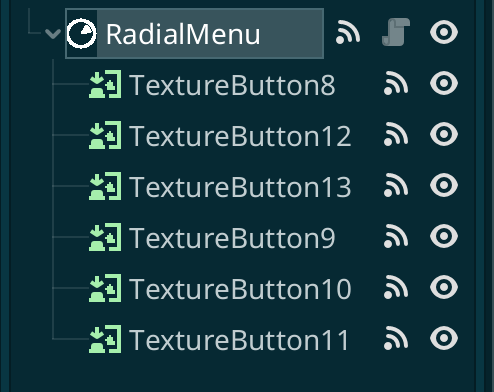
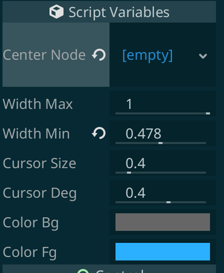

# Table of Contents

1.  [Godot Radial Menu](#org654cb69)
    1.  [Setup](#org2212cac)
    2.  [Supported signals](#org400324d)
    3.  [Supported controls](#supported-controls)
        1.  [Center Node](#orged0e028)
        2.  [Width max](#org4852680)
        3.  [Width min](#orgb230a63)
        4.  [Cursor size](#orgf753784)
        5.  [Cursor deg](#orge39ffb3)
        6.  [Color BG](#orgd8ac455)
        7.  [Color FG](#org4c1fc31)
        8.  [Bevel Enabled](#bevel-enabled)
        9.  [Bevel Color](#bevel-color)
        10. [Bevel Width](#bevel-width)
        11. [Modulate Enabled](#modulate-enabled)
        12. [Modulate Color](#modulate-color)
        13. [Modulate Width](#modulate-width)

# Godot Radial Menu

I created this Radial Menu as an addon for a few of my projects.

The rendering of the menu is primarily done through shader code and so should be pretty performant.

https://user-images.githubusercontent.com/100964/155878180-1aabfeb7-f246-46c4-b6a6-e60346d8279c.mov

## Setup

    func _ready():
        $RadialMenu.connect("selected", self, "_on_selected")

    func _input(event: InputEvent):
        if event is InputEventScreenTouch:
            $RadialMenu.set_visible(event.pressed)

    func _on_selected(child: Node):
        prints("Child was selected:", child)

## Supported signals

`hovered(child)` Emitted when a button or child is hovered

`selected(child)` Emitted when a button or child is selected

## Supported controls

### Center Node

`set_center_node(Node)`

Controls display in center of the spinner

### Width max

`set_width_max(Float)`

- Minimum: 0
- Maximum: 1

The outside edge size of the spinner

### Width min

`set_width_min(Float)`

- Minimum: 0
- Maximum: 1

The inside edge size of the spinner

### Cursor size

`set_cursor_size(Float)`

- Minimum: 0
- Maximum: +ve PI

The size of the radial arc (blue portion)

### Cursor deg

`set_cursor_deg(Float)`

- Minimum: -ve PI
- Maximum: +ve PI

The starting degree of the cursor (will update with mouse or touch
events)

### Color BG

`set_color_bg(Color)`

Background color of the radial (supports RGBA)

### Color FG

`set_color_fg(Color)`

Foreground color of the radial (supports RGBA)

### Bevel Enabled

`set_bevel_enabled(bool)`

Should a bevel be present on the edges of the modal

### Bevel Color

`set_bevel_color(Color)`

What color should the bevel be (if present)

### Bevel Width

`set_bevel_width(float)`

What should the width of the bevel be (if present)

### Modulate enabled

`set_modulate_enabled(bool)`

If enabled, buttons will be automatically modulated to the colors selected when hovered and unhovered

### Modulate hover

`set_modulate_hover(Color)`

Color modulation to be applied to each button (or control) when it's hovered.
This is only applied i `modulate_enabled` is true

### Modulate default

`set_modulate_default(Color)`

Color modulation to be applied to each button (or control) in it's default state.
This is only applied i `modulate_enabled` is true

## Support

